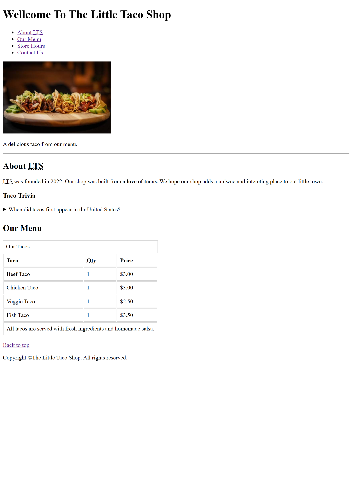
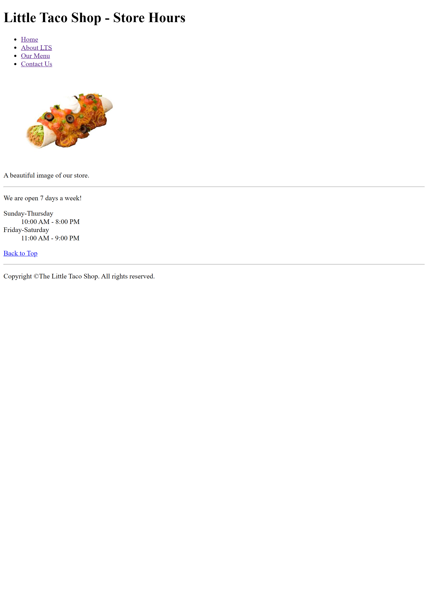
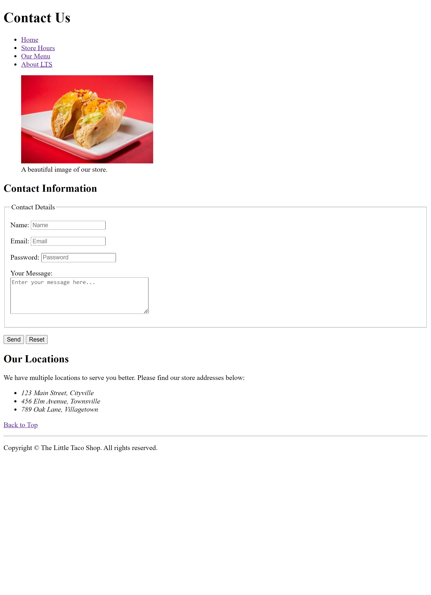

# 🌮 The Little Taco Shop

A semantic, responsive, and accessible multi-page restaurant website built with pure HTML5 and 1 Percent CCSS.

---

## 📸 Project Previews

| Home Page | Store Hours | Contact Page |
| :---: | :---: | :---: |
|  |  |  |

---

## ✨ Features
- **Multi-page Architecture:** Navigation across Home, Store Hours, and Contact pages.
- **Semantic HTML5:** Structured using `<header>`, `<nav>`, `<main>`, `<section>`, `<figure>`, `<figcaption>`, and `<footer>`.
- **Menu Pricing Table:** Complete table layout using `<thead>`, `<tbody>`, `<tfoot>`, and `<abbr>`.
- **Operating Hours:** Implemented with Description Lists (`<dl>`, `<dt>`, `<dd>`).
- **Accessible Contact Form:** Fully labeled form controls, fieldsets, and legends.

---

## 🛠️ Built With
- HTML5
- 1 Percent CSS3
